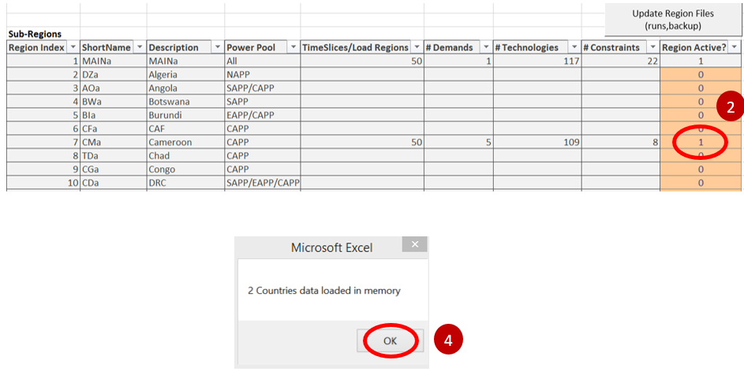
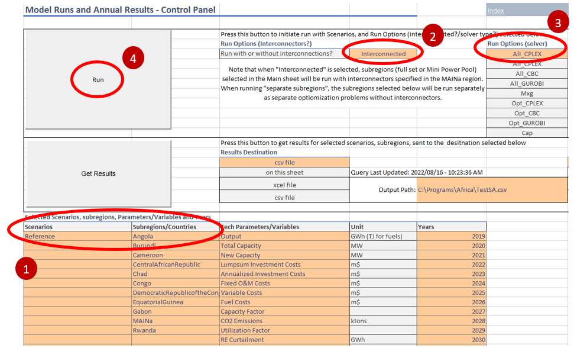

.. role:: inputcell
    :class: inputcell
.. role:: interfacecell
    :class: interfacecell
.. role:: button
    :class: button

Getting Started
===============

.. _prerequisites:

Pre-requisites
--------------
Before using the SPLAT interface, ensure that you have the following software installed

-	Microsoft Excel
-	MESSAGE

The MESSAGE software comes with a free solver called GLPK. If a different solver is needed, it will have to be installed separately. Refer to :ref:`using_message` for using alternative solvers.

.. _conventions:

Conventions
----------------

:inputcell:`User Input Cell`

Cells formatted as above (dark font with orange background) are user input cells, where the user is allowed and expected to enter data.

:interfacecell:`Reserved for Interface`

Cells formatted as above (dark font with pale grey background) are cells that are reserved for interface. These cells are populated by macros in the workbook or are calculated cells.

The tabs are organised according to the following conventions:

-	``Index`` sheet: lists all the sheets in the workbook
-	``Main`` sheet: where users set the model path, and select countries in the model
-	Yellow tabs: for reviewing and updating basic model inputs
-	Red tabs: for running a model and extracting results
-	Grey tabs: utilities available for more advanced users

.. _first_steps:

First Steps
--------------
This documentation uses a simple model [to link] for demonstration. You can use an existing MESSAGE model for most of the examples in this documentation.

.. _opening_file:

Opening the file
++++++++++++++++
Open the Excel file that starts with *SPLAT_Interface_...*. When you open the file, you must click *Enable Content* (as shown below) for the file to function.

.. _checking_decimal:

Checking system's decimal symbol
++++++++++++++++++++++++++++++++++
The "decimal separator" of your system must be set to '.' (point) in order for the SPLAT Excel interface to function properly. If it is otherwise, e.g. ',' (comma), please go to Control Panel > Region > Additional settings, and change decimal symbol to '.'.

The comma separator is often the default in French windows environments and would have to be changed in order to be able to use the interface.

.. _link_interface:

Linking the interface to your model file
+++++++++++++++++++++++++++++++++++++++++

1. In the ``Main`` tab of the file, make sure the fields "Model Folder" and "Main Region" are set correctly as shown below, to reflect the location of the MESSAGE model files on your computer.

2. Click the :button:`Reload Global` button at the top of the page (this connects the MESSAGE model files with this Excel workbook).

3. You will see a pop-up window which says "2 Countries data loaded in memory" (as shown below); press :button:`OK`.

.. image:: getting_started_linking_interface_1.PNG

4. In the Sub-Regions section of the ``Main`` tab, make sure your country is the only one active, by placing a "1" next to it in the orange column, and a "0" next to any other countries.

5. Once you have done this, click on the :button:`Update Region Files` button.

6. Press the :button:`Reload Global` button once again at the top of the page.

7. After it is complete, you should see a pop-up window which says "2 Countries data loaded in memory" (as shown below); press :button:`OK`.

.. _view_results:

Viewing model results
++++++++++++++++++++++

The SPLAT Excel interface allows a user to easily see the input data stored in SPLAT-MESSAGE models.

In any of the yellow tabs, the user must first choose the scenario from the dropdown list in cell C3. Then, by pressing the button :button:`Refresh Sheet`, as shown below, the data stored in the model will show in the table.

Keep in mind that the "adb" scenario contains all of the basic data in the model. Choosing another scenario will show only the data that is **different** in that scenario. So, if you choose a scenario and the data is blank, then it means it has the same data as the "adb".

This process works the same way for all the yellow tabs (``Demand``, ``Transmission``, ``Distribution``, etc.) of the SPLAT Excel Interface.

.. _run_model:

Running the model
++++++++++++++++++

After linking your model to the interface file in the ``Main`` tab, you can run your SPLAT model using the SPLAT Excel interface. The ``ReportGen-Annual`` tab is where you can do this.

1.	Ensure that you have selected the correct scenario and country combination that you want to run.

2.	Ensure the correct option is selected under the "Run" categories. The categories correspond to the same options in the MESSAGE "Run" menu: ``Mxg`` = Matrix Generator; ``Opt`` = Optimisation; ``Cap`` = Cap file creation; ``All`` = perform all of the above. There are two different options provided in the interface for CPLEX and CBC, depending on which solver you have pre-installed. Note that the CBC option can only be used through this SPLAT Excel interface.

3.	Press the :button:`Run` button. You should see the black MESSAGE window appear and begin to run.

.. _extract_results:

Extracting the results
++++++++++++++++++++++

Use the ``ReportGen`` tab
~~~~~~~~~~~~~~~~~~~~~~~~~
The ``ReportGen-Annual`` tab is also where you can pull in the results of the model that you just ran.

1.	Ensure that you have selected the correct scenario and country combination that you want to view the results of.

2.	After that is checked, all you need to do is press the button in the sheet :button:`Get the results from the model you just ran` (red circle in picture below). You should see raw results appear beneath the tables when the process is finished.

Update the results charts
~~~~~~~~~~~~~~~~~~~~~~~~~
You can find the yearly result charts in the sheets: ``Capacity``, ``Output``, ``New Capacity``, ``CO2``, and ``Costs``.

.. important::

    Please be sure to check that the correct scenario and country are chosen at the top of the table.

Right-click anywhere in the table on the worksheet, and select :button:`Refresh` from the options. These charts need to be updated **every time** you pull in new results.

