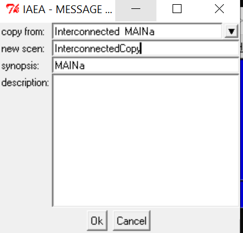

.. role:: inputcell
    :class: inputcell
.. role:: interfacecell
    :class: interfacecell
.. role:: button
    :class: button

How-To Guides
=============

.. _change_decimal_seperator:

Change decimal seperator in windows environment
----------------------------------------------

.. image:: /images/how_to_ChangeDecimalSeparator1.png

.. image:: /images/how_to_ChangeDecimalSeparator2.png

.. image:: /images/how_to_ChangeDecimalSeparator3.png

.. image:: /images/how_to_ChangeDecimalSeparator4.png

.. image:: /images/how_to_ChangeDecimalSeparator5.png

.. image:: /images/how_to_ChangeDecimalSeparator6.png

.. image:: /images/how_to_ChangeDecimalSeparator7.png

.. _install_solver:

Installing an Alternative (Faster) Free Solver
----------------------------------------------

The MESSAGE software comes by default with a free solver called GLPK. This solver is adequate for working with small models, however, when a larger model is to be used (e.g. many timeslices, many technologies and subregions), this solver becomes inadequate requiring a long time to complete a "RUN".

There is an alternative free solver that can be used with MESSAGE called the CBC (`Coil-or Branch and Cut solver`_) that is more powerful and can solve larger problems at comparable speeds to some of the commercial solvers such as CPLEX.

However, to execute runs with this solver one must use the SPLAT Excel Interface to initiate runs (see Tutorial C - Using the SPLAT Excel Interface) and one has to add the solver to the user's existing MESSAGE installation. This guide gives a brief description on how to do this installation.

1. Download the cbc.rar archive file from the `cbc link`_ and put it in the MESSAGE installation folder called:
``C:\Programs\MESSAGE_INT\message_bin``

.. _cbc link: https://irena.sharepoint.com/:u:/r/sites/EPS/PTG%20Tools%20and%20Data/SPLAT%20kit/Software/AlternativeSolver/cbc_files.rar?csf=1&web=1&e=QPdmhj

.. _Coil-or Branch and Cut solver: https://github.com/coin-or/Cbc

.. image:: /images/how_to_1.png

2. Use a 3rd party software such as Winrar to extract the files from ``cbc.rar`` into the ``C:\Programs\MESSAGE_INT\message_bin`` folder (use "extract here")
Some of the files may already exist in the folder, you can accept to overwrite those files with the ones from the ``cbc.rar`` archive.

.. _using_message:

Restoring and opening a model using the MESSAGE interface
----------------------------------------------------------

1. Save the (SPLAT) model ZIP file that starts with ``\MAINa_...`` into a known location of the computer

2. After installation of MESSAGE, open the program and two windows will open; the blue one is the user interface for Windows OS and the black one is the command window for MESSAGE.

.. important::

    You will use the blue windows. Do NOT close the black window as it will close the MESSAGE interface:

.. image:: /images/how_to_using_message_1.png

.. image:: /images/how_to_using_message_2.png

3. Select :button:`Cases` > :button:`Restore`

.. image:: /images/how_to_using_message_3.png

4. Select the ZIP file ``MAINa_...`` located in the place you previously saved

.. image:: /images/how_to_using_message_4.png

5. Select :button:`Cases` > :button:`Open`

.. image:: /images/how_to_using_message_5.png

.. image:: /images/how_to_using_message_6.png

6. Select "Africa" and your country code (Please see Table).

.. image:: /images/how_to_using_message_9.png

For example, suppose your country is Cameroon, then you choose the code CMa, then the following window will appear with Case Study : CMa.

.. image:: /images/how_to_using_message_7.png

.. image:: /images/how_to_using_message_8.png

7. You have now the Country model of your choice, which you can edit or work with. If you click :button:`Edit` and then click :button:`application db`, you get the following screen which you can use to view most of your model's input data.

.. image:: /images/how_to_using_message_10.png

.. _message_copy_scenario:

Copying a scenario using the MESSAGE interface
-----------------------------------------------

1. Open your model in MESSAGE. If you have not restored your model before, please restore it for the first time. (:ref:`using_message`)

2. Select :button:`Cases` > :button:`Scenario`> :button:`Copy scenario`

3. In the pop out window, select the scenario of your choice and enter the name of the new copy. Click :button:`OK`.

4. If you are working in a region with multiple sub-regions, select :button:`Yes` for :button:`Make copy for all subregions`?

.. image:: how_to_copy_scenario_2.PNG

5. In the SPLAT interface Main sheet, Reload global. You will find the new scenario you copied in the Scenarios table. To use the new scenario, select ``1`` in Scenarios to Reload